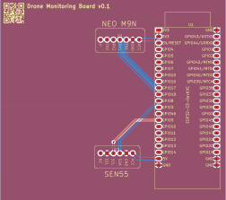
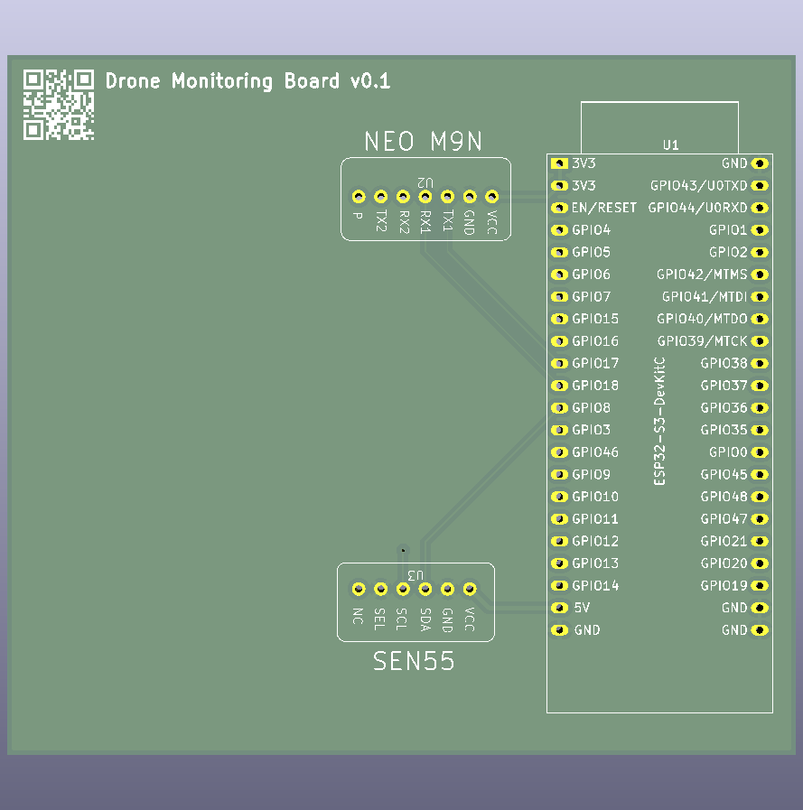
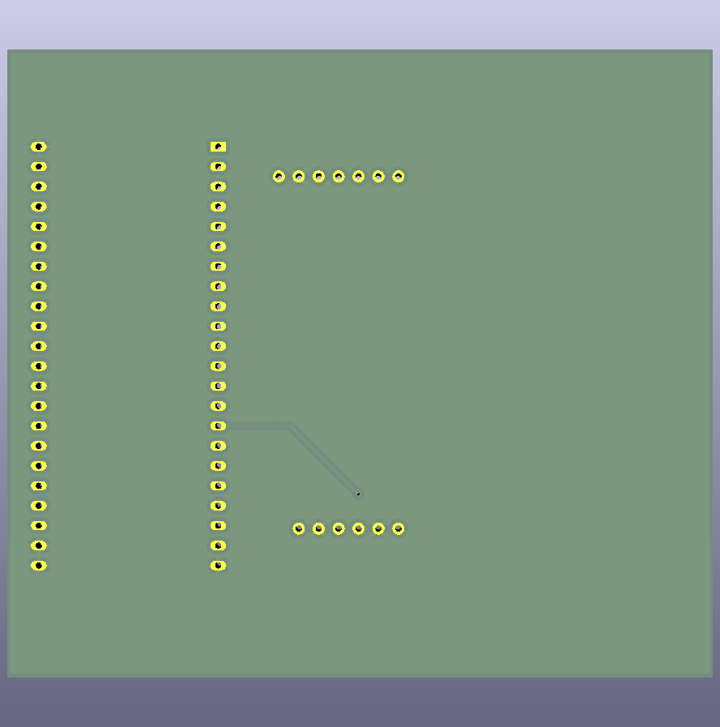
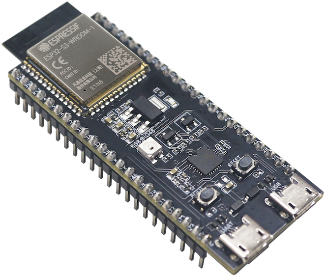
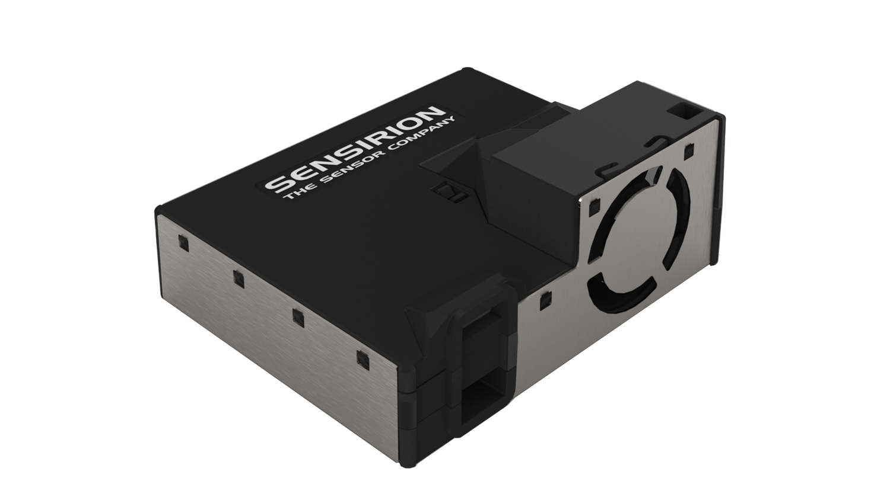
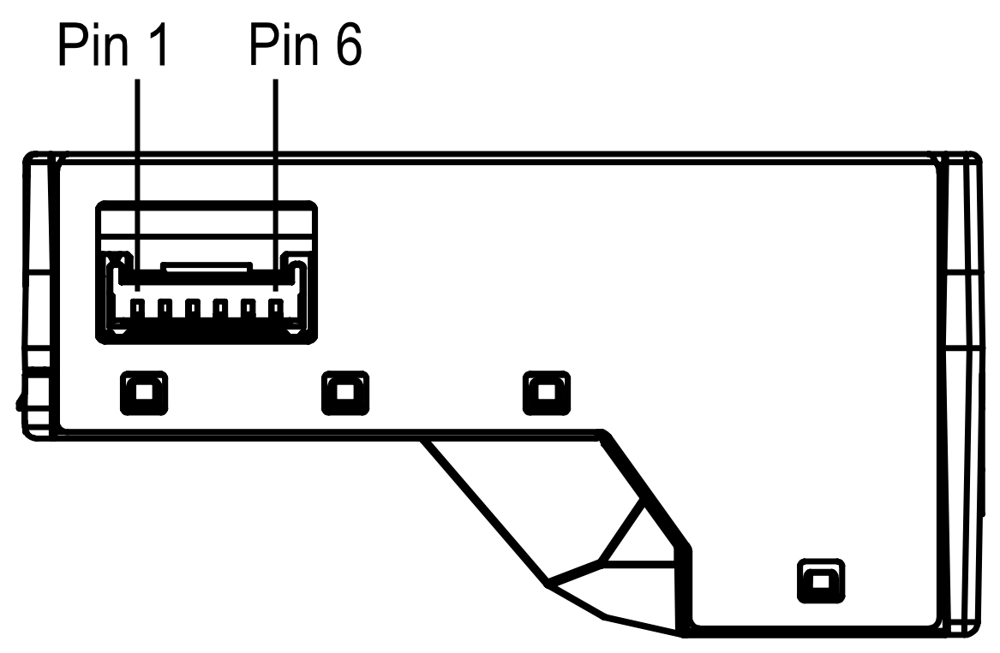
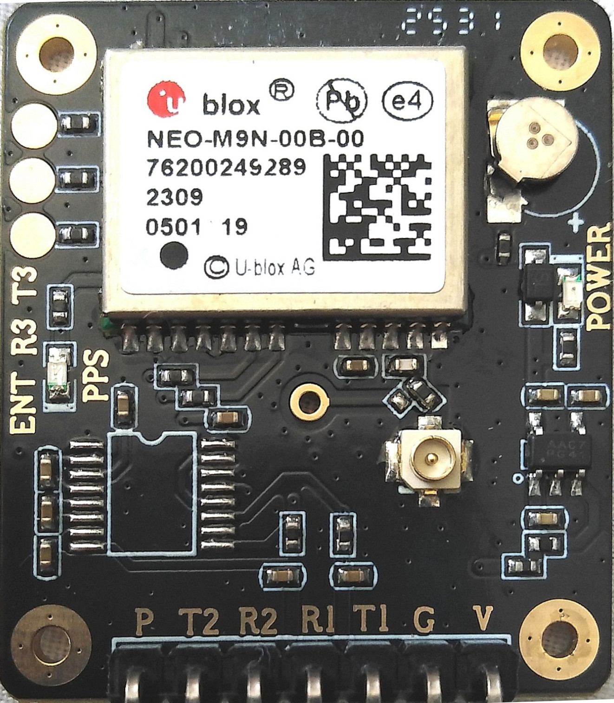
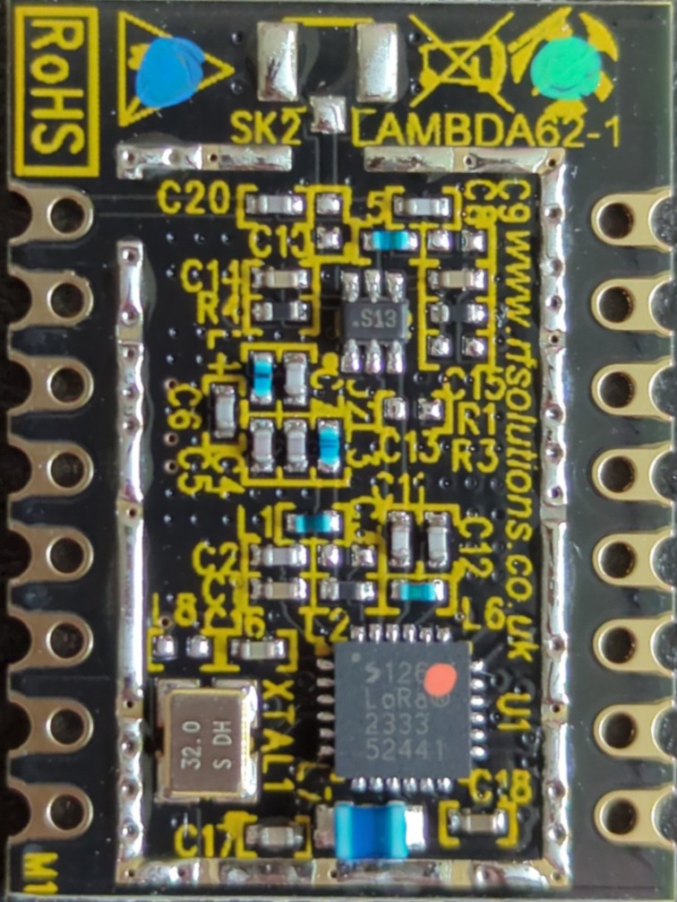
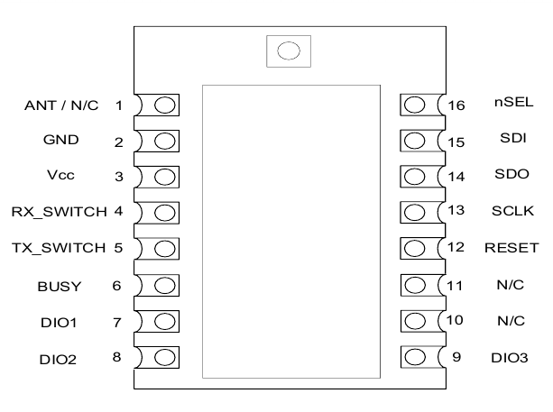
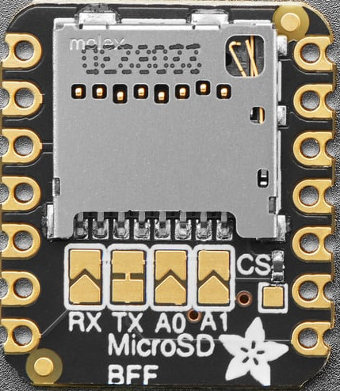

# PCB wiring

 

## ESP32-S3-DevKitC-1u

User guide for [ESP32-S3-DevKitC-1](https://docs.espressif.com/projects/esp-dev-kits/en/latest/esp32s3/esp32-s3-devkitc-1/user_guide_v1.1.html)

## Sensirion SEN55

[SEN55 Datasheet](https://sensirion.com/products/catalog/SEN55)

This is the Sensirion SEN5X library for Arduino using the
modules I2C interface.

| *SEN5X* |  *Arduino*  | *Jumper Wire* | ESP32 pin |
| :-----: | :---------: | :-----------: | :-------: |
|   VCC   |     5V      |      Red      |    5V     |
|   GND   |     GND     |     Black     |    GND    |
|   SDA   |     SDA     |     Green     |   GPIO8   |
|   SCL   |     SCL     |    Yellow     |   GPIO9   |
|   SEL   | GND for I2C |     Blue      |    GND    |

| *Pin* | *Name* | *Description*                   | *Comments*                       |
| ----- | ------ | ------------------------------- | -------------------------------- |
| 1     | VCC    | Supply Voltage                  | 5V ±10%                          |
| 2     | GND    | Ground                          |
| 3     | SDA    | I2C: Serial data input / output | TTL 5V and LVTTL 3.3V compatible |
| 4     | SCL    | I2C: Serial clock input         | TTL 5V and LVTTL 3.3V compatible |
| 5     | SEL    | Interface select                | Pull to GND to select I2C        |
| 6     | NC     | Do not connect                  |

## UBLOX NEO M9N-00B

[Ublox NEO M9N-00B](https://www.u-blox.com/en/product/neo-m9n-module?legacy=Current#Documentation-&-resources)

## LoRa LAMBDA62-8S (868MHz)

[LAMBDA62 Datasheet](https://www.rfsolutions.co.uk/radio-modules/lambda-62-lora-transceiver-module-20km-featuring-semtech-sx1262/)

## Adafruit MicroSD BFF

[Reference](https://www.adafruit.com/product/5683)

